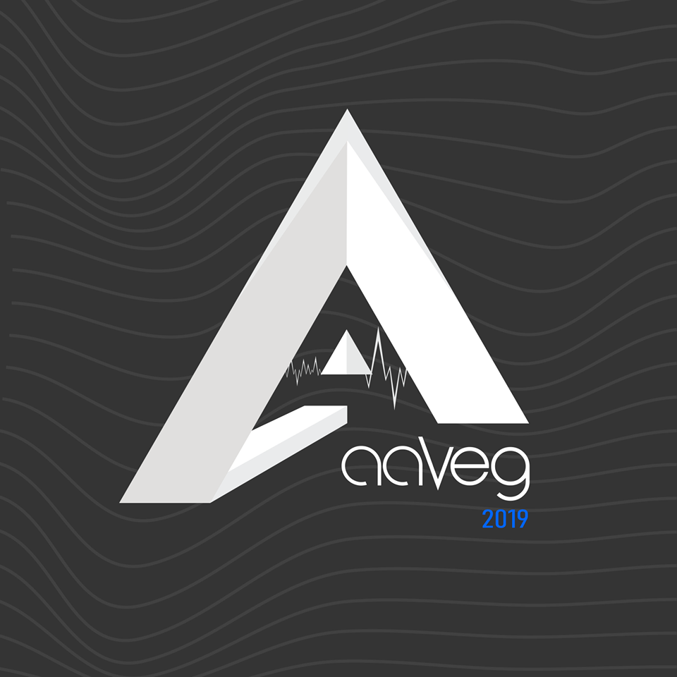

# Aaveg

Website and app backend for Aaveg.

## Developing

### Built With

NodeJS, Express

### Prerequisites

You need to install Node, npm and mongoDB

### Setting up Dev

```shell
git clone https://github.com/SubashAravindan/AavegWebsite
cd AavegWebsite/config
cp config.example.js config.js
#Replace the values in config.js
npm install
npm install -g standard
npm install -g node-mongo-seeds
seed
mkdir logs && touch logs/erros.log logs/warnings.log
```

### General Coding Advice

- Follow the coding style given below
- Maintain the project structure (routes, conrollers etc).
- Work on feature branches and give a PR to dev with proper rebasing. Dont push.
- Use ES6+ features to write clean code. Especially async await, template strings etc
- _Update README_
- Add seed data if needed
- Use the winston library for logging. No console.log plis

## Style guide

We'll be using the standard JS coding style. Check https://standardjs.com/. Always stick to this style pls.

To check for errors, run :

```shell
standard
```

Most of the times, this following command will magically fix it for you :)

```shell
standard --fix
```

PLEASE DON'T COMMIT CODE WITHOUT PROPER FORMATTING

## Api Reference

Coming soon...
